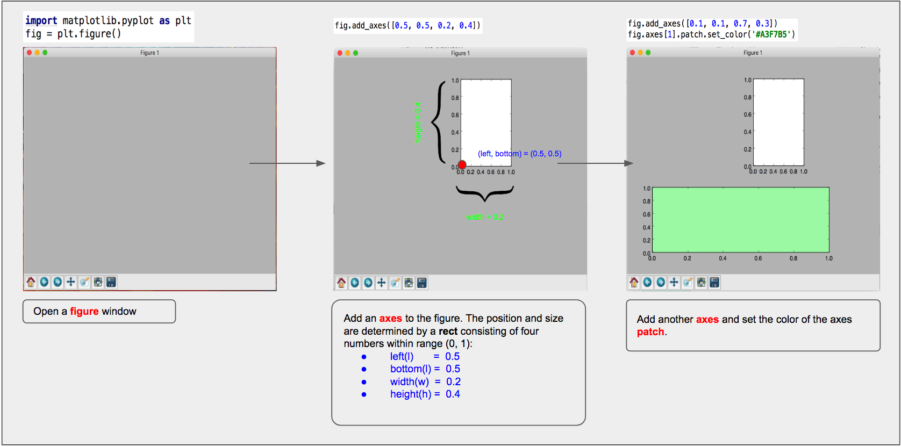
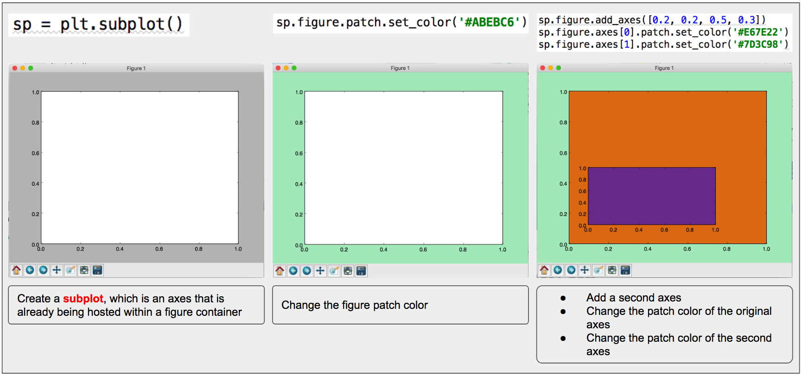
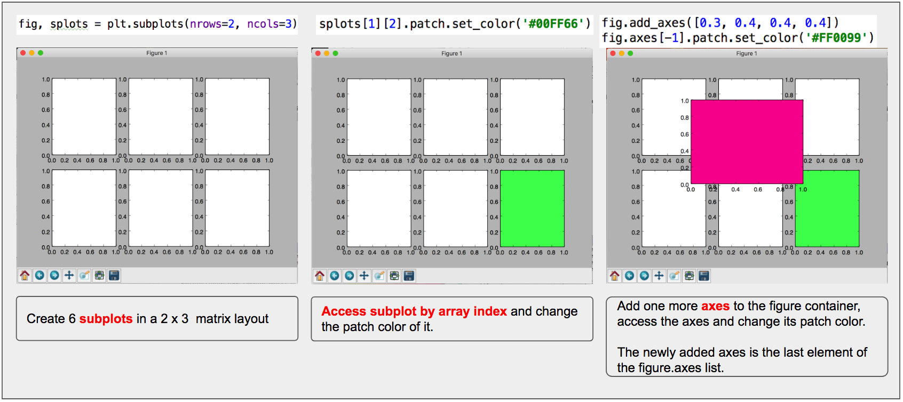

# Matplotlib low level graphic elements

## Figure, Axes and Subplot

* **`Figure`** is a window or a top level container which hosts axes or any other graphic elements.
* **`Axes`** is a plotting area or a coordinate system for plotting. **`Axes`** can not exist without a **`Figure`** instance.
* **`Subplot`** is an **`Axes`** which is already bound to a **`Figure`** instance.

### Figure and Axes

The image below shows how axes instances are added to a figure instance:

### Subplot

The image below shows how to create a **`subplot`** and edit it.

We can easily create multiple subplots within a figure container with `subplots()`. The image below
shows how to create multiple subplots within a figure container, how to access specific subplot and edit
its attributes and how to add additional axes to a figure container which already hosts multiple subplots.

## Figure parameters and attributes

### Figure parameters

Below is a comparison between two figure instances with different parameter values.

