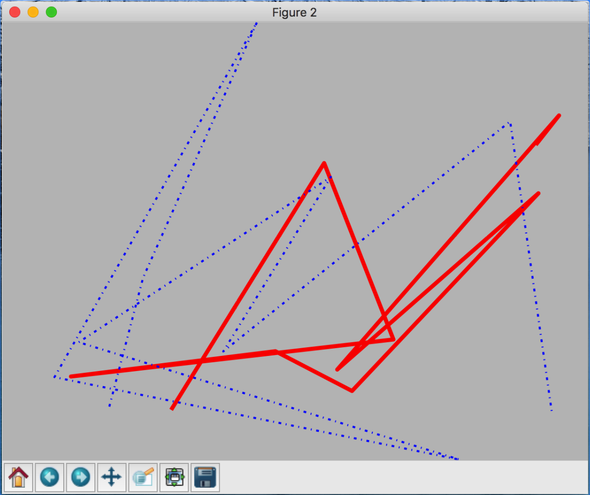
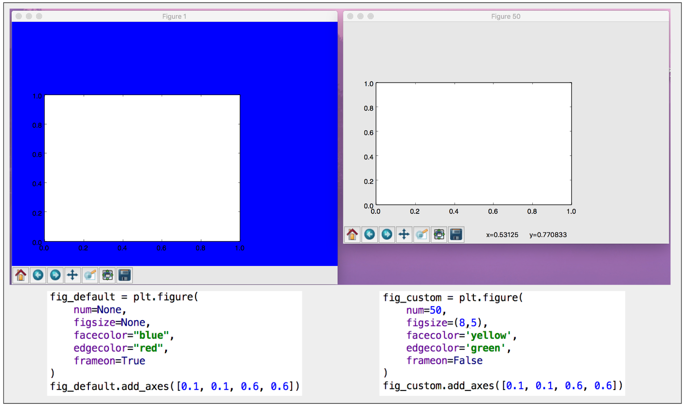

# Matplotlib low level graphic elements

## Figure, Axes and Subplot

* **`Figure`** is a window or a top level container which hosts axes or any other graphic elements.
* **`Axes`** is a plotting area or a coordinate system for plotting. **`Axes`** can not exist without a **`Figure`** instance.
* **`Subplot`** is an **`Axes`** which is already bound to a **`Figure`** instance.

### Figure and Axes

The image below shows how axes instances are added to a figure instance:


### Subplot

The image below shows how to create a **`subplot`** and edit it.


We can easily create multiple subplots within a figure container with `subplots()`. The image below
shows how to create multiple subplots within a figure container, how to access specific subplot and edit
its attributes and how to add additional axes to a figure container which already hosts multiple subplots.


## `Line2D` and `Patch`

### `Line2D`

**`Line2D`** class is used to draw a variety of line styles. Like **`Axes`** instances, **`Line2d`** instances
can be added to a figure container.

```python
import numpy as np
x1, y1 = np.random.rand(10), np.random.rand(10)
x2, y2 = np.random.rand(10), np.random.rand(10)

# Line2D and Patch
from matplotlib.lines import Line2D
l1 = Line2D(xdata=x1, ydata=y1, transform=fig.transFigure, figure=fig, color='red', linewidth=4.0)
l2 = Line2D(xdata=x2, ydata=y2, transform=fig.transFigure, figure=fig, linestyle='-.', color='blue', linewidth=2.0)

# figuare attributes
fig = plt.figure()
fig.lines.extend([l1, l2])
fig.canvas.draw()
```



## Figure parameters and attributes

### Figure parameters

Below is a comparison between two figure instances with different parameter values.




